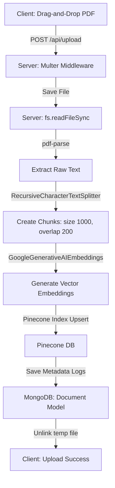
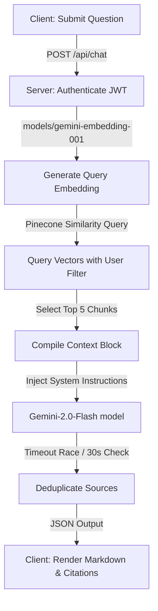

# Second Brain 🧠 - Full Project Summary & Architecture Specification

Second Brain is a robust, full-stack **Retrieval-Augmented Generation (RAG)** application. It empowers users to upload PDF documents, parse and index them into a vector database, and conduct secure, context-aware conversations powered by state-of-the-art Large Language Models (LLMs) with precise source citations.

---

## 🛠️ 1. Technical Stack

The application is architected as a decoupled client-server project:

### 💻 Frontend (Client)
*   **Core Library**: React (Vite)
*   **Routing**: React Router DOM v6 (utilizing route protectors for authorization)
*   **Styling**: Tailwind CSS & Vanilla CSS (custom design tokens and utility classes)
*   **Animations**: Framer Motion (page entry transitions, button micro-behaviors, typing indicators)
*   **Icons**: Lucide React
*   **HTTP Client**: Axios (configured with request interceptors to auto-inject Bearer JWTs)
*   **Markdown Parsing**: React Markdown (to render rich text, headers, lists, and tables returned by the LLM)

### ⚙️ Backend (Server)
*   **Runtime Environment**: Node.js
*   **Application Framework**: Express.js
*   **Primary Database**: MongoDB (for user profile stores, file metadata logs, and ingestion history)
*   **Vector Database**: Pinecone (for storing, indexing, and executing similarity searches on chunk embeddings)
*   **AI/LLM Platform**: Google Gemini API via the `@google/generative-ai` SDK & `@langchain/google-genai` wrappers
*   **Authentication**: Passport.js (Google OAuth 2.0 Strategy) & jsonwebtoken (stateless JWT issue/verify)
*   **File Upload & PDF Extraction**: Multer (disk storage buffers) & `pdf-parse` (binary buffer parsing)
*   **Notifications**: Nodemailer (SMTP configurations with Ethereal fallback for dev environments)

---

## 📂 2. Project Directory Organization

```
SecondBrain/
├── client/                     # Frontend Application
│   ├── src/
│   │   ├── api/               # Axios central config & interceptors
│   │   ├── assets/            # Static assets
│   │   ├── components/        # Shared components
│   │   │   ├── AuthLayout.jsx            # Form layout for auth screens
│   │   │   ├── ChatInterface.jsx         # Chat room & Markdown output
│   │   │   ├── FileUpload.jsx            # Ingestion dropzone & upload progress
│   │   │   ├── ProtectedRoute.jsx        # Private route wrapper
│   │   │   └── DeepSpaceBackground.jsx   # Interactive layout backgrounds
│   │   ├── context/
│   │   │   └── AuthContext.jsx           # Global user state & session methods
│   │   ├── pages/             # Route-level page layouts
│   │   │   ├── LandingPage.jsx           # Product marketing & specs
│   │   │   ├── Dashboard.jsx             # Combined upload/chat interface
│   │   │   ├── Profile.jsx               # Profile adjustments & history
│   │   │   ├── Login.jsx                 # Login credentials screen
│   │   │   └── Signup.jsx                # New account registration screen
│   │   ├── App.jsx            # Route declarations & AnimatePresence
│   │   ├── main.jsx           # React DOM bootstrapping
│   │   └── index.css          # Design system CSS rules
│   ├── tailwind.config.js     # Extended color palette & animation keyframes
│   └── package.json           # Client packages and build configurations
│
├── server/                     # Backend API Service
│   ├── config/
│   │   ├── db.js              # Mongoose MongoDB connection
│   │   └── passport.js        # Passport Google strategy mapping
│   ├── controllers/
│   │   ├── chatController.js  # RAG querying, embeddings, and chat models
│   │   └── uploadController.js# PDF reading, text chunking, and index upsert
│   ├── middleware/
│   │   └── auth.js            # JWT verification & tenancy injection middleware
│   ├── models/
│   │   ├── User.js            # Mongoose schema for user accounts
│   │   └── Document.js        # Mongoose schema for document indexing records
│   ├── routes/
│   │   ├── auth.js            # User credentials, updates, avatar, & history endpoints
│   │   ├── chatRoutes.js      # AI chat entry point
│   │   └── uploadRoutes.js    # Document upload entry point
│   ├── services/
│   │   ├── emailService.js    # Welcome messages & security logins
│   │   └── pineconeService.js # Pinecone SDK client initialization
│   ├── uploads/               # Temporary file storage directory
│   ├── server.js              # Application entry point
│   └── package.json           # Server packages & launch scripts
└── README.md                  # Development instructions
```

---

## 🔄 3. Core Pipelines & RAG Data Flow

### 📥 A. Document Ingestion Pipeline


1.  **Ingestion & Parsing**: The client sends a multipart request containing a PDF file to `/api/upload`. The backend reads the file buffer using `pdf-parse` to extract plain text.
2.  **Text Chunking**: The extracted text is processed via LangChain's `RecursiveCharacterTextSplitter` with a `chunkSize` of 1000 characters and a `chunkOverlap` of 200 characters, preserving contextual continuity at chunk boundaries.
3.  **Embedding Generation**: The text chunks are processed through Google Generative AI Embeddings (`models/gemini-embedding-001`) with the task type set to `RETRIEVAL_DOCUMENT` to yield multi-dimensional vectors.
4.  **Vector Store & Metadata**: The embeddings are upserted into the Pinecone index. Crucially, each vector's metadata is injected with tracking attributes:
    ```javascript
    {
      text: chunk.pageContent,
      filename: file.originalname,
      user: req.user.id,
      documentId: file.filename
    }
    ```
5.  **Database Recording**: A document ledger entry is created in MongoDB referencing the user, size, file name, and vector ID prefix. Finally, the raw local file is unlinked from server storage.

---

### 💬 B. Contextual Query & Response Pipeline


1.  **Token Processing**: The client posts a payload containing `question` and `documentId` (optional) to `/api/chat`. The Bearer token in the request header is verified by authorization middleware.
2.  **Query Vectorizing**: The system generates a single embedding of the question using `models/gemini-embedding-001` under the task type `RETRIEVAL_QUERY`.
3.  **Filtered Similarity Search**: The index is queried to find the top 5 closest matching vectors (`topK: 5`). Strict multi-tenant security filters are applied:
    ```javascript
    const filter = { user: req.user.id };
    if (documentId) filter.documentId = documentId;
    ```
4.  **Prompt Assembly**: Retrieved texts are joined into a context block and combined with structured instructions:
    *   Directs the model to use simple, clear formatting (bold headers, bullet points).
    *   Instructs the agent to prioritize document context, falling back to general knowledge with a disclaimer if the answer is absent.
5.  **Reasoning & Return**: The prompt is processed using Google's `gemini-2.0-flash`. The execution is wrapped in a `Promise.race` timeout block to terminate hangs after 30 seconds. Sources are deduplicated, and a JSON response containing the markdown answer and source citations is returned.

---

## 🗄️ 4. Database Schema Specifications

### 👤 User Schema (`User.js`)
Stores user accounts and OAuth configurations:
*   `email`: String, required, unique.
*   `password`: String, optional (not required for OAuth registrations).
*   `googleId`: String, optional (assigned via Google Strategy).
*   `facebookId`: String, optional (reserved for future social login).
*   `username`: String, optional (profile configuration).
*   `bio`: String, optional (profile configurations).
*   `profilePicture`: String, optional (stores static URL path to uploaded avatar).
*   `phoneNumber`: String, optional.
*   `location`: String, optional.
*   *Pre-save Hook*: Automatically hashes plaintext passwords with `bcryptjs` using a salt work factor of 10.
*   *Schema Methods*: `matchPassword` compares hashed passwords during credential login.

### 📄 Document Schema (`Document.js`)
Logs files ingested by the RAG system:
*   `user`: ObjectId, required, references the `User` model.
*   `filename`: String, required (original upload name).
*   `fileType`: String, default `pdf`.
*   `size`: Number.
*   `vectorId`: String (acts as the namespace prefix in Pinecone index).
*   *Timestamps*: Active tracking (`createdAt` and `updatedAt`).

---

## 🔐 5. Security & Isolation

*   **Stateless Authentication**: Access tokens are signed using JWT containing the user database ID and expire in 30 days.
*   **Tenancy Isolation**: Database records use user ID foreign keys. In Pinecone, index namespaces are shared but operations enforce strict user ID metadata filtering (`filter: { user: req.user.id }`).
*   **File Upload Validation**: Multer configurations reject files that do not match the PDF mime type (`application/pdf`). Avatar uploads are restricted strictly to image mime types (`image/*`).
*   **Credential Hashing**: User passwords are saved as hashed strings, protected against potential database leaks.

---

## ✉️ 6. Notification Service

Nodemailer handles system emails.
*   **Transporter Adaptability**:
    *   *Development/Testing*: Automatically constructs a temporary test account using `nodemailer.createTestAccount()` and routes emails to `smtp.ethereal.email` (returning preview links in logs).
    *   *Production*: Connects to real production SMTP servers (e.g., SendGrid, Gmail) using host, port, user, and password variables.
*   **Welcome Routine**: Automatically sends HTML welcome templates upon signup.
*   **Security Alerts**: Dispatches warnings with timestamps when login routes are successfully completed.

---

## 🚀 7. Environment Variables Configuration

Create a `.env` file in the `server` directory:

```env
PORT=5000
MONGO_URI=mongodb+srv://<username>:<password>@cluster.mongodb.net/second-brain
JWT_SECRET=your_jwt_secret_key_here

# AI & Vector Settings
GEMINI_API_KEY=your_gemini_api_key_here
PINECONE_API_KEY=your_pinecone_api_key_here
PINECONE_INDEX=second-brain

# Social Sign-in OAuth (Optional)
GOOGLE_CLIENT_ID=your_google_client_id_here
GOOGLE_CLIENT_SECRET=your_google_client_secret_here
CLIENT_URL=http://localhost:5173

# Email Configurations (Production)
SMTP_HOST=smtp.gmail.com
SMTP_PORT=587
SMTP_USER=your_email@gmail.com
SMTP_PASS=your_email_password
```
